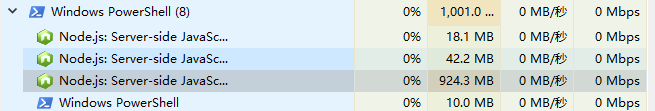
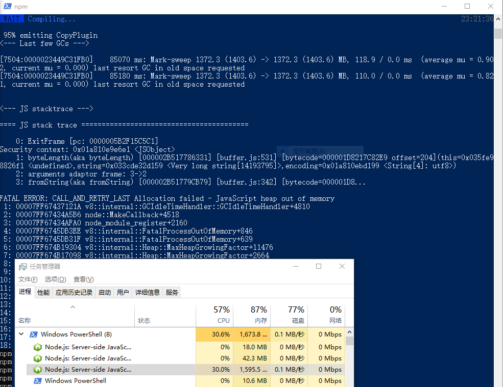

# 多页面开发时性能问题

## 复现步骤
1. 克隆仓库，切换到**`master`**分支
2. 运行`npm run dev`启动项目
3. 打开活动监视器，找到webpack的node进程，记录下node进程内存使用值

4. 找到`src/main.js`或者其他的文件，编辑然后保存，目的是触发webpack编译，记录下编译时长（friendly-errors-webpack-plugin会打印出时间），如果连续快速保存文件多次，webpack会一直编译，同时node进程内存会快速增长，就有可能内存不足导致进程结束

5. 切换到**`splitChunks`**分支，并运行`npm run dev`启动项目
6. 在活动监视器中可以看到启动项目后内存占用比前面要低很多
