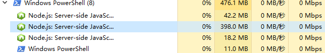
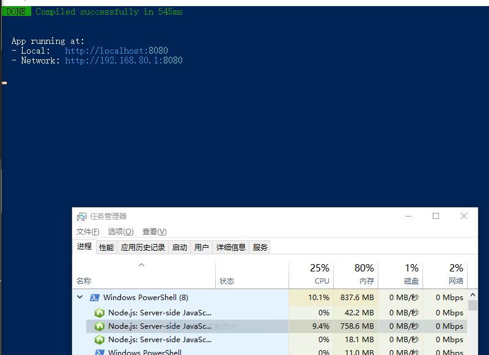

# 多页面开发时性能问题

## 复现步骤

1. 克隆仓库，切换到`master`分支
2. 运行`npm run dev`启动项目
3. 打开活动监视器，找到 webpack 的 node 进程，记录下 node 进程内存使用值

   - 启动项目后
   
   

4. 找到`src/main.js`或者其他的文件，编辑然后保存，目的是触发 webpack 编译，记录下编译时长（friendly-errors-webpack-plugin 会打印出时间），如果连续快速保存文件多次，webpack 会一直编译，同时 node 进程内存会快速增长，就有可能内存不足导致进程结束

   - 修改两次文件后进程崩溃
   
   

5. 切换到`splitChunks`分支，并运行`npm run dev`启动项目
6. 在活动监视器中可以看到启动项目后内存占用比前面要低很多，并且连续保存文件，内存上升幅度较小，并且编译时间低了很多
   - 启动项目后
   
   
   - 多次修改文件后内存使用情况
   
   

## master 分支与 splitChunks 分支区别

`splitChunks`分支添加了`optimization.splitChunks`配置

```js
module.exports = {
  // ...其他的配置
  chainWebpack: config => {
    config.optimization.splitChunks({
      cacheGroups: {
        vendors: {
          name: 'chunk-vendors',
          test: /[\\/]node_modules[\\/]/,
          priority: -10,
          chunks: 'initial'
        },
        common: {
          name: 'chunk-common',
          minChunks: 2,
          priority: -20,
          chunks: 'initial',
          reuseExistingChunk: true
        }
      }
    })
  }
}
```

## 原因分析
使用了splitChunks，使得多个入口共用一份`chunk-vendors`和`chunk-common`，这样就不会每个入口都编译一次`node_modules`下面的文件和其他公共的文件，并且由于提取了公共chunk，所以文件保存触发webpack重新编译时，只要提取的chunk没改变就不会重新编译提取出来的chunk，重新编译的速度也会明显上升
